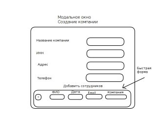
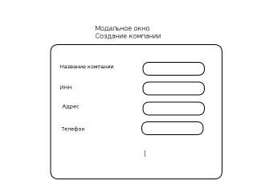
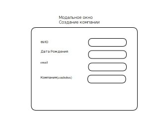

###Технические задание:
1) Дано есть таблица со списком компаний, у каждой компании есть сотрудники.
2) Необходимо создать приложение в котором будет возможность добавлять/удалять/редактировать компании.
3) Создание и редактирование должно происходить в модальном окне.
4) Нужна возможность добавлять и просматривать список сотрудников для каждой компании.
5) Компания {название, инн, адрес, телефон}
6) Сотрудник {фио, дата рождения, email, Компания}
7) Для создания приложения используем БД postgresql и Vaadin
Дальше идут примеры всего(таблиц, колонок, типов колонок, описания) для понимания визуальной составляющей и исключения ошибок при создании приложения.

##### Таблица Компаний

| Название      | ИНН           | Адрес         | Телефон       |
|:-------------:|:-------------:|:-------------:|:-------------:|
| ООО "Бобр Строй"| 4124124     | г. Нижний Бобруйск, ул. Казаков, д. 63 | 8-999-999-99-99 |

Разметка колонок
1. Название — String — с валидатором
2. ИНН — Integer 
3. Адрес — String — с валидатором
4. Телефон — String с валидатором

##### Таблица сотрудников

| ФИО      | Дата Рождения           | Email         | Компания       |
|:-------------:|:-------------:|:-------------:|:-------------:|
| Иванов Иван Иванович| 02.04.1963     | ivanov.ivan@gmail.com | ООО "Бобр Строй" |

Разметка колонок
1. ФИО — String с валидатором
2. Дата Рождения — LocalDate
3. email — если есть тип email → email, иначе String с валидатором
4. Компания — String с валидатором, возможно привязка к первой таблице по полю как ключ <?>

Примеры модальных окон
Создание/Редактирование компании и сотрудников

Создание компании с формой добавления сотрудников в одном окне

Без формы добавления сотрудников 

Форма создания сотрудника

